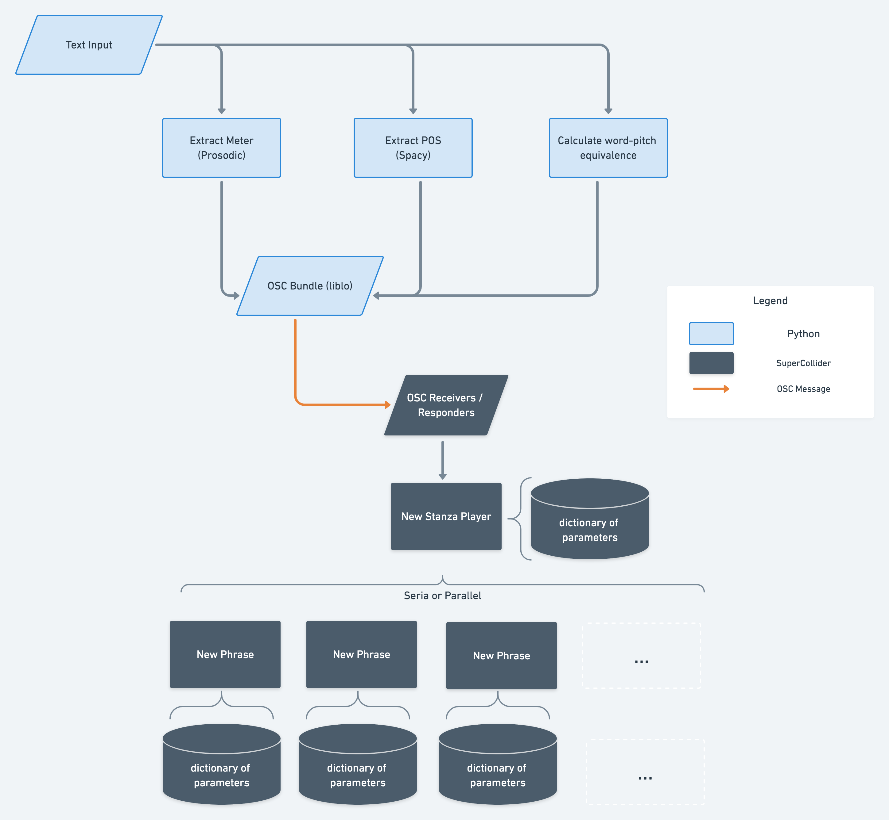
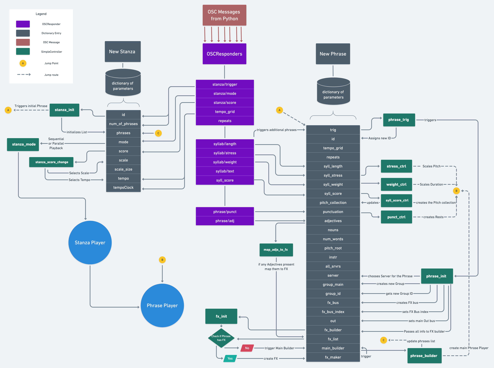
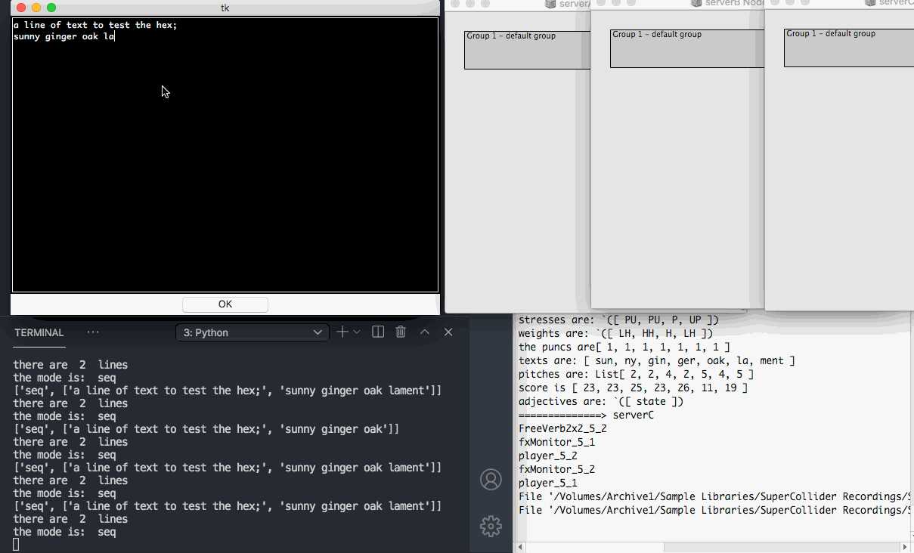

# Introduction

PoeSC is a compositional and live-coding interface that uses plain text as a coding grammar to generate musical phrases. Currently english is supported. 
It is developed with [Python](https://www.python.org/) and [Supercollider](https://supercollider.github.io/).  
After text is input via Python, [NLP analysis](https://en.wikipedia.org/wiki/Natural_language_processing) is performed and data is sent to SuperCollider via [OSC](https://en.wikipedia.org/wiki/Open_Sound_Control) where it is mapped and transformed into sound.  
It is a "slow-coding" experience and most of the text/sound isomorphisms are product of my arbitrary/subjective taste. This is not an attempt to a _meaningful_ sonification of language, rather a speculation towards a musically creative use of "natural" textual structures. An attempt to an esolang of sorts.  
The development of this project was possible through the support of the [Musikfonds "Neustart Kultur" Stipendienprogramm 2020/2021](https://www.musikfonds.de/wp-content/uploads/2020/07/MF-Stipendienprogramm_Ausschreibung_200713.pdf) scholarship.

# Background 

PoeSC started as an endeavour to create musical meso-structures through live coding.
In my practice up to the beginning of the project I would struggle with the fact that my live-coding output would tend towards repetitive structures. I was interested in developing a method of generating a varied rhythmical narrative that could evolve easily into complex sonic constructions which could span numerous seconds.  
I focused my research into [Formal Grammars](https://en.wikipedia.org/wiki/Formal_grammar) as a way of understanding basic parsing and articulate the problem programmatically. Out of this effort, [Curtis Roads'](https://www.curtisroads.net/bio) paper "Composing Grammars" (1978) (accessible [here](https://quod.lib.umich.edu/cgi/p/pod/dod-idx/composing-grammars.pdf?c=icmc;idno=bbp2372.1977.011;format=pdf)) turned out to be very influential, as it presented in a systematic way a "structural/linguistic" model of developing a composing ecosystem. In parallel, I discovered the current work of [Allison Parrish](https://github.com/aparrish) in computational poetry and the use of programming languages in creating poems.  
This fusion of perspectives established for me the main pivotal point of the project. I realized that common speech/text includes in its metrical structures the variation of rhythm and meter I was looking for and a potential for creative complexity through NLP.  
All this, of course, would not have been possible without the latest developments in Natural Language Processing, so I'm indebted to the work of the people active in that field. The project is heavily based on the Python libraries [spacy](https://github.com/explosion/spaCy) and [prosodic](https://github.com/quadrismegistus/prosodic), for NLP and metrical analysis.

# Structure

## General

A [Model-View-Controller](https://en.wikipedia.org/wiki/Model%E2%80%93view%E2%80%93controller) design pattern is loosely applied, with:
- the _View_ being the text-input interface, 
- the _Controller_ being classes of _OSCResponder_ and _SimpleController_ in SuperCollider 
- and the _Model_ are dictionaries of sonic parameters under control

The user inserts text through a simple Tkinter window in Python. This is analysed:

- Metrically by the [prosodic](https://github.com/quadrismegistus/prosodic) python extension. 
- POS (Part Of Speech) analysis by [spacy](https://github.com/explosion/spaCy)
- Word "score" calculation (which later affects pitch) based on [Letter Frequency analysis](https://en.wikipedia.org/wiki/Letter_frequency)
- OSC communication between Python and SuperCollider is implemented using [pyliblo3](https://pypi.org/project/pyliblo3/)  

After the analysis, all data are transmitted to SuperCollider as an OSC Bundle.  

Each new block of text entered by the user creates a __Stanza__ player in Supercollider. The number of lines contained in each block of text create equal __Phrase__ players. The role of the __Stanza__ player is to include and sequence these  __Phrase__ players. There can be only 1 __Stanza__ player for each text block and as many __Phrase__ players as the lines of text entered.

## The synthesis engine in SuperCollider

As soon as the OSC messages are received in SuperCollider they are mapped to numerous parameters.  

<!--  -->
<figure>
  
  <figcaption>Detailed flowchart - Click for larger view  </figcaption>
</figure>  

4 Servers are used in SuperCollider and whenever a new Phrase is initialized a Server is chosen according to its idleness. This is done in order to avoid audio dropouts from server overloading. In addition, each Phrase is initialized within a new Group and with its own FX. As soon as the Phrase is done playing, Group, FX and Pattern proxies are cleaned from memory. 

# Current Status : Under development

The interface is functional with the following steps already established:

## in Python:
* Basic core and communication between Python and Supercollider is established, using [pyliblo3](https://pypi.org/project/pyliblo3/)
* Metrical analysis of text is fully developed, solely based on the python library [prosodic](https://github.com/quadrismegistus/prosodic)
* NLP analysis ( using [spacy](https://github.com/explosion/spaCy) ) is at a primary stage: 
    * Sentence-splitting established 
    * Punctuation detected and mapped
    * Adjectives detected and mapped
    * Each letter is assigned a score, based on [Letter Frequncy analysis](https://en.wikipedia.org/wiki/Letter_frequency)
* Basic GUI for text input using [tkinter](https://en.wikipedia.org/wiki/Tkinter)
## in SuperCollider:
* Stanza dictionary & player established
* Phrase dictionary & player established
* Completed OSC receivers and corresponding Controllers:
    * Stanza trigger 
    * Stanza score
    * Stanza mode 
    * Syllable length
    * Syllable weight
    * Syllable stress 
    * Syllable text
    * Syllable score
    * Phrase punctuation
    * Phrase Adjectives  

  

# TO DO
- Update the current README regarding:
    - Dependencies
    - How to use
    - Detailed table of current rules of the program
- Develop in SuperCollider:
    - Automatic initialization document
    - Repetitions Model
    - TempoGrid Modulation
    - Pitch Root Modulation (mtranspose)
    - Develop Sample Based SynthDefs
    - Instrument selection Model
    - Further POS mapping (nouns, verbs etc)
- Develop in Python:
    - Further POS Models 
    - a better GUI implementation

# Disclaimer

Author: Thomas Chousos / Tadklimp  
This is a documentation repository of my personal compositional process.  
Please feel free to fork and analyze and I hope you'll find inspiration.  
